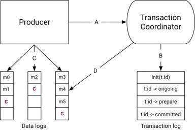

**Transaction coordinator** - модуль в каждом брокере. каждому координатору принадлежит N разделов в transaction log разделы, для которых брокер является лидером.\
**Transaction log** - внутренний топик kafka где хранится только последнее состояние транзакции и связанные метаданные.\
**Transactional.id** - сопоставляется с определенным разделом transaction log функцией хеширования т.е. каждый transactional.id принадлежит только одному координатору.\

**Поток данных можно разбить на четыре различных типа:**\
**A)** во время транзакции **Producer** связывается с **Transaction coordinator** в следующих точках:\
  - **1** -> в момент инициализации tr: регистрируется tr.id, все трансакции с тем-же tr.id закрываются, увеличивается epoch.\
  - **2** -> перед первой отправкой данный в tr\
  - **3** -> когда приложение commit или abort tr: запрос на вторую фазу протокола зваершения.

**B)** взаимодействие **Transaction coordinator** и **Transaction log**:
   - по мере выполнения **Transaction**, **Producer** отправляет запросы (1-3) в **Transaction coordinator**, он в свою очередь сохраняет состояние каждой транзакции в **Transaction log**.
   - **Transaction coordinator** - единственный компонент, который может читать и записывать в **Transaction log**. если брокер почил, избирается новый и чтение/запись в **Transaction log** продолжается.

**C)** после регисрации новых partitions в **Transaction coordinator**, **Producer** сохраняет данные в **partitions** как обычно.

**D)** после того как **Producer** инициирует commit/abort **Transaction coordinator** начинает вторую стадию протокола commit.
   - на первом этапе **Transaction coordinator** обновляет внутренний статус tr до prepare_commit и обновляет **Transaction log**
   - на втором этапе **Transaction coordinator** записывает маркеры во все partitions участвующие в tr. эти маркеры используются для consumers в режиме read_committed чтобы отфильтровать сообщения из прерванных transaction и сообщений из открытых transaction.
   - после того как маркеры записаны - **Transaction coordinator** записывает в **Transaction log** committed, после чего **Producer** может открывать новую transaction.