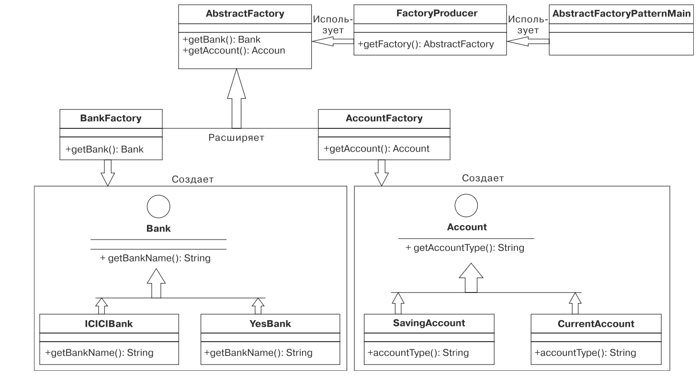

### паттерн проектирования
понятие инженерии програмного обеспечения, 
описывающее часто применяемые решения для распространенных проблем проектирования ПО

---

#### отличитрельные признаки:
- относится к конкретному к конкретному сценарию а не платформе. его контекстом являются окружающие условия в которых существует проблема
- разработаны для поиска оптимального решения определенных задач, возникающих при создании программного обеспечения.
- представляют собой решение только тех проблем, для которых пред- назначены.

---

#### порождающие паттерны: 
позволяют конструировать объекты, когда одних конструкторов недостаточно. 
Логика создания объектов скрывается. Программы, в основе которых лежат эти паттерны, обеспечивают больше гибкости
при создании объектов в соответствии с вашими нуждами и сценариями использования приложения.

#### структурные паттерны:
имеют дело с композицией классов или объектов. Существует две основные методики повторного использования функциональности в ООП: 
наследование классов и композиция объектов. Наследования применяется для композиции интерфейсов 
и определения способов композиции объектов в целях создания новой функциональности.

#### поведенческие паттерны:
касаются способов взаимодействия и распределения обязанностей между классами или объектами. 
Особенно тесно связаны с обменом информацией между объектами. 
Служат для контроля сложных потоков данных в приложениях.

---

### [Factory](Factory.java)
#### Порождающий паттерн

Согласно этому паттерну, для получения объекта класса можно не раскрывать клиенту нижележащую логику. 
Новый объект назначается вызывающей стороне с помощью общего интерфейса или абстрактного класса.\
Это значит, что данный паттерн скрывает:
- фактическую логику реализации объекта 
- способ его создания 
- какой класс он воплощает.

В результате клиента не будет заботить создание объекта, управление и уничтожение Factory возьмет на себя

используется для решения следующих проблем:
- избавляет разработчика от бремени создания объектов и управления ими.
- избавляет от тесного сцепления между взаимодействующими компонентами, тк компонент не может заранее знать, какие подклассы ему понадобится создать
- избавляет от жестко зашитого кода создания объекта класса.

---

### [Abstract Factory](AbstractFactory.java)
#### Порождающий паттерн

.

Обеспечивает интерфейс для создания семейств взаимосвязанных или взаимозависимых объектов без указания конкретных классов.
Паттерн более высокого уровня, чем Factory. Согласно ему необходимо просто описать интерфейс или абстрактный класс 
для создания взаимосвязанных или взаимозависимых объектов без указания конкретных классов.

набор фабричных методов, объединенный в фабрику с помощью паттерна проектирования «Factory», получаем фабрику фабрик. 
таким образом нам больше не требуется знать подробности обо всех фабриках в этой фабрике. 
для написания программы достаточно информации о фабрике верхнего уровня.

Преимущества паттерна AbstractFactory:
- слабое сцепление между семействами компонентов. 
- изоляция кода клиента от конкретных классов.
- обеспечивает лучшую согласованность в масштабах приложения во время конструирования объектов.
- обеспечивает легкость замены семейств компонентов.

При проектировании паттерна Factory для создания объектов в приложении бывает необходимо скомпоновать определенный набор
взаимосвязанных объектов с конкретными ограничениями и использовать в них нужную логику. 
Для этого можно создать внутри фабрики еще одну фабрику для набора взаимосвязанных объектов и наложить на них требуемые ограничения, 
а затем написать логику для данного набора.
можно использовать, если требуется адаптировать логику создания объектов к конкретной задаче.

---

### [Prototype](Prototype.java)
#### Порождающий паттерн

Используется для создания объектов путем клонирования на основе экземпляра-прототипа. 
Когда создание объекта и инициализации начальных значений требует значительных затрат ресурсов. Имеет смысл воспользоваться Prototype. 
Например, когда объект создается после операции с базой данных. Объект можно кэшировать, вернуть его клон при следующем запросе 
и обновлять базу по мере необходимости, уменьшая таким образом количество требуемых обращений к ней. 
При этом просто копируется уже существующий подобный объект вместо создания нового.
Этот паттерн включает реализацию прототипного интерфейса в целях создания клона существующего объекта.

Преимущества паттерна Prototype:
- уменьшает время, необходимое для создания объектов.
- сокращает создание производных классов. 
- добавляет и удаляет объекты во время выполнения. 
- динамически задает настройки классов приложения.

---

### [Builder](Builder.java)
#### Порождающий паттерн

Позволяет создавать сложные объекты пошагово и использовать один и тот же код для создания различных представлений объектов.

Преимущества паттерна Builder:
- полная изоляция процесса конструирования объекта от его представления. 
- возможность конструирования объекта в несколько этапов, что позволяет получить больше контроля над процессом конструирования.
- широкие возможности варьирования внутреннего представления объекта.

Builder имеет смысл использовать, если процесс создания объекта состоит из нескольких шагов. 
На каждом из шагов выполняется часть процесса. 
В ходе создания объекта задаются необходимые и необязательные параметры, и в результате получается сложный объект.

---

### [Adapter](Adapter.java)
#### Структурный паттерн

Adapter служит мостом между двумя несовместимыми интерфейсами и используется, когда два интерфейса приложения функционально несовместимы, 
но их нужно объединить из-за бизнес-требования.

Преимущества паттерна Adapter:
- возможность взаимодействия между двумя или более несовместимыми объектами. 
- способствует повторному использованию уже существующих более старых элементов функциональности.

используется для решения следующих проблем:
- нужно воспользоваться существующим классом, интерфейс которого несо- вместим с вашими нуждами.
- нужно создать в своем приложении повторно используемый класс который должен взаимодействовать с классами с несовместимыми интерфейсами.
- использовать несколько существующих подклассов, но адаптировать их интерфейсы но создавать производные подклассы от каждого из них нецелесообразно. Лучше применить адаптер объектов для подгонки интерфейса родительского класса.

---

### [Bridge](Bridge.java)
#### Структурный паттерн

Bridge предоставляет способ добиться взаимодействия между двумя различными независимыми компонентами, 
а также способ расцепления абстрактного класса и класса-реализатора. Поэтому любые изменения в классе реализации или реализаторе(интерфейсе) 
не повлияют ни на абстрактный класс, ни на класс расширенной абстракции. 
Это становится возможным благодаря композиции интерфейса и абстракции.

Преимущества паттерна Bridge:
- позволяет разделить реализацию и абстракцию.
- обеспечивает достаточную гибкость внесения изменений в классы обоих типов без какого-либо влияния на клиентский код.
- позволяет скрывать нюансы фактической реализации от клиента за счет наличия между ними абстракции.

используется для решения следующих проблем:
- если нужно устранить стойкую привязку функциональной абстракции к ее реализации.
- если нужно вносить изменения в классы реализации без какого-либо влияния на абстракцию и клиентский код.
- если нужно дать возможность расширять абстракцию и ее реализацию с помощью подклассов.

---

### [Composite](Composite.java)
#### Структурный паттерн

Объекты можно объединять в древовидные структуры, отражающие иерархии типа часть—целое. 
Благодаря составному объекту клиенты могут работать одинаковым образом как с отдельными объектами, так и с их композициями.

суть Composite в том, что клиент взаимодействует с группой объектов одного типа как с единым объектом. 
Идея паттерна Composite состоит в композиции набора объектов в древовидную структуру, которая бы представляла модуль большего приложения. 
А клиенты рассматривают эту структуру как единое целое. 
Объекты в системе группируются в древовидную структуру, представляющую собой сочетание узлов-листьев и веток. 
В ней узлы могут иметь листья и другие узлы, а у листьев нет никаких дочерних элементов. 
Листья рассматриваются как конечные точки структурированных в дерево данных.

Преимущества паттерна Composite:
- облегчает добавление новых видов компонентов, избавляя от необходимости вносить в клиент изменения.
- позволяет создавать иерархию классов, включающую как отдельные, так и составные объекты.

---

### [Decorator](Decorator.java)
#### Структурный паттерн

Decorator представляет особую разновидность структурного паттерна проектирования и позволяет динамически/статически добавлять 
и исключать поведение отдельных объектов, не изменяя имеющееся поведение других связанных объектов того же класса. 
При этом не нарушаются принципы SOLID

Для задания ассоциаций объектов оказывается предпочтение композиции вместо наследования, дает возможность разделять функциональность
на различные классы с непересекающимися областями ответственности.

Преимущества паттерна:
- позволяет динамически и статически расширять функциональность, не меняя структуры существующих объектов.
- с помощью этого паттерна можно динамически назначить объекту новую обязанность.
- чтобы обеспечить соблюдение принципов SOLID, он использует композиции взаимосвязей объектов.
- упрощает написание кода благодаря созданию новых классов для каждого элемента функциональности вместо изменения существующего кода приложения.

---

### [Combinator](Combintor.java)
#### Структурный паттерн

Комбинатор хорошо известен в функциональном программировании. 
Идея состоит в том, чтобы объединить примитивы в более сложные структуры.

используется для решения следующих проблем:
- валидация обьектов

---

### [Facade](Facade.java)
#### Структурный паттерн

Фасад - просто интерфейс интерфейсов, предназначенный для упрощения взаимодействия клиентского кода и классов подсистемы.

Преимущества паттерна :
- упрощает для клиентов взаимодействие с подсистемами.
- делает более понятными все бизнес-сервисы, объединяя их в единые интерфейсы
- снижает количество зависимостей клиентского кода от внутренних механизмов системы

используется для решения следующих проблем:
- если проектируем систему, состоящую из огромного множества независимых классов и набора сервисов, которые нужно реализовать. 
Фасад позволяет упростить систему и взаимодействие клиентского кода с классами подсистем большой сложной системы.

----

### [Proxy](Proxy.java)
#### Структурный паттерн

Заместитель позволяет получить объект класса, обладающий функциональностью другого класса. 
Его цель предоставить окружающему миру класс-заместитель другого класса, со всей его функциональностью.

Преимущества паттерна :
- сокрытие реального объекта от окружающего мира.
- повышение производительности за счет создания объекта по запросу.

используется для решения следующих проблем:

---

### [Observer](Observer.java)
#### Поведенческий паттерн

Согласно этому паттерну между объектами приложения формируется такая зависимость типа «один ко многим», 
что при модификации одного из объектов все остальные зависимые объекты оповещаются автоматически.
Observer Создает механизм подписки позволяющий одним объектам следить и реагировать на события происходящие в других объектах.
Предлагает хранить внутри объекта издателя список ссылок на объекты подписчиков, причём издатель не должен вести
список подписки самостоятельно. Он предоставит методы, с помощью которых подписчики могли бы добавлять или убирать себя из списка.

Преимущества паттерна:
- расцепленная связь между субъектом и наблюдателем.
- поддержка транслирования.

---

### [Visitor](Visitor.java)
#### Поведенческий паттерн

Позволяет добавлять в программу новые операции не изменяя классы объектов над которыми эти операции будут проводиться.

Преимущества паттерна :
- позволяет разместить новое поведение в отдельном классе, вместо того чтобы множить его в нескольких классах

используется для решения следующих проблем:
- когда код классов стабилен, 
- добавление нового функционала нарушает принцип SOLID, 
- а также мы хотим оставаться гибкими добавляя и изменяя функциональность

---

### [Chain of Responsibility](ChainOfResponsibility.java)
#### Поведенческий паттерн

Цепочка обязанностей - отправитель и получатель запроса должны быть расцеплены. 
Отправитель посылает запрос цепочке получателей, каждый из которых может оказаться его обработчиком.
У объекта-получателя есть ссылка на другой объект-получатель, если активный объект не может обработать запрос, 
то передает тот же запрос следующему в цепочке получателю.

Преимущества паттерна:
- снижение сцепления между объектом-отправителем и объектом-получателем при обработке запроса.
- гибкость распределения обязанностей по обработке запроса между объектами.
- создание цепочки объектов с помощью композиции, которая функционирует как единое целое.

Недостатки паттерна:
- если процессор упал вызывая следующий процессор, комманда потеряется
- если процессор вызовет неправильный процессор, комманда зациклится
- возможно получить большой stack traces, что скажется на производительности
- может иметь дублирующийся код, что затруднит поддержку

используется для решения следующих проблем:
- Spring использует этот паттерн для цепочек фильтров безопасности.
- RabbitMQ использует этот паттерн в своей основе.

---

### [Command](Command.java)
#### Поведенческий паттерн

Команда - простой, ориентированный на работу с данными паттерн. Он позволяет инкапсулировать данные запроса в объекте 
с последующей передачей этого объекта в качестве команды методу-инициатору, 
который затем возвращает результат выполнения этой команды в виде другого объекта изначальной вызывающей стороне.

Преимущества паттерна :
- дает возможность перемещать данные между компонентами системы (отправителем и получателем) в виде объекта.
- позволяет задавать параметры объектов в соответствии с выполняемым действием.
- дает возможность легко добавлять новые команды в систему без изменения существующих классов.

---

### [Interpreter](Interpreter.java)
#### Поведенческий паттерн

Интерпретатор - позволяет анализировать элементы языка выражений для описания представления его грамматики.

Преимущества паттерна:
- возможность с легкостью менять и расширять грамматику
- легкость и удобство использования языка выражений

---

### [Iterator](Iterator.java)
#### Поведенческий паттерн

Итератор - обеспечивает способ последовательного обращения к элементам составного объекта без раскрытия его внутреннего представления.

Преимущества паттерна :
- удобный доступ к элементам коллекции
- доступ к элементу коллекции возможен несколькими способами, поскольку паттерн поддерживает множество вариантов обхода
- единообразный интерфейс обхода различных структур в коллекции

---

### [Template method](TemplateMethod.java)
#### Поведенческий паттерн

Шаблонный метод - абстрактный класс обертывает некоторые заранее выбранные части алгоритма в метод, 
позволяющий переопределять его части без переписывания. Для выполнения подобных операций можно использовать конкретный класс

Преимущества паттерна :
- уменьшение объема стереотипного кода в приложении за счет переиспользо- вания кода.
- создает шаблон - способ повторного использования нескольких схожих алгоритмов в целях удовлетворения каких-либо бизнес-требований

---

### 
#### Поведенческий паттерн

Преимущества паттерна :

используется для решения следующих проблем:

---

### 
#### Поведенческий паттерн

Преимущества паттерна :

используется для решения следующих проблем:

---